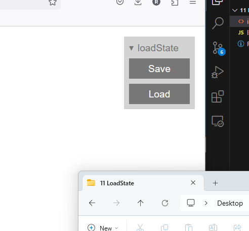

# Load State

 Load and Save buttons for any website. 

# Live Demo

[Live Demo](https://strawstack.github.io/LoadState/)

# How to use

Import and configure `loadState.js` as seen below and in `index.html`.

```html
<script src="loadState.js"></script>
<script>
    loadState({ 
    save: () => {
        return JSON.stringify({key: "example save data"})
    }, 
    load: (data) => console.log(`Loaded: ${data}`)
    });
</script>
```


# Screenshot



# Demo Video

https://youtu.be/4TZtSirOH28
